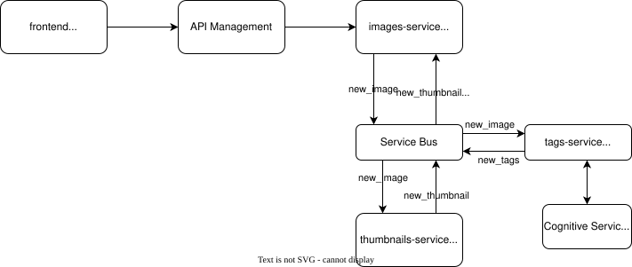

# PhotoTag - Projektowanie Systemów Rozproszonych

## Diagram


## How to run the project

### Login to Azure using Azure CLI:
```bash
az login
```

### Initialize terraform:
```bash
terraform init
```
Alternatively you can initialize with remote backend (see [BACKEND.md](BACKEND.md))

### Deploy infrastructure:
```bash
terraform plan
terraform apply
```

### Deploy services (same method for every service - example for images-service):
```bash
cd images-service
func azure functionapp publish <images_service_name> --python
cd ..
```

You can get \<images\_service\_name> from terraform output

## Deploying frontend app
### Option 1 - deploy on kubernetes:
#### Build and deploy app to acr:
```bash
cd app
docker build -t <acr_login_server>/app:tag .
az acr login --name <acr_login_name>
docker push <acr_login_server>/app:tag
```
You can get \<acr\_login\_server> from terraform output

\<acr\_login\_name> is \<acr\_login\_server> without the domain name (without ".azurecr.io")
#### Update image address in deployment.yaml

#### Get kube config:
```bash
terraform output -raw kube_config > ~/.kube/config
```

#### Deploy the frontend app (actually we use ArgoCD on main branch):
```bash
kubectl apply -f deployment.yaml
```

#### Port-forward the app:
```bash
kubectl port-forward deployment/app-deployment 8501:8501
```

### Option 2 - run locally:
#### Get the subscription key and API url from terraform output:
```bash
export SUBSCRIPTION_KEY=$(terraform output -raw subscription_key)
export API_URL=$(terraform output -raw api_url)
```

#### Run the app:
```bash
streamlit run app/app.py
```
